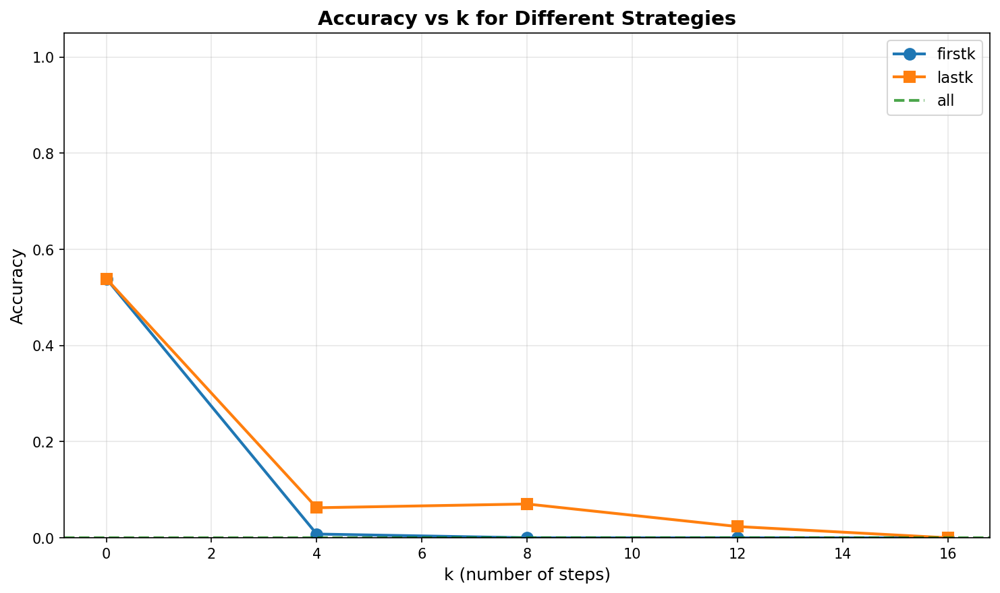
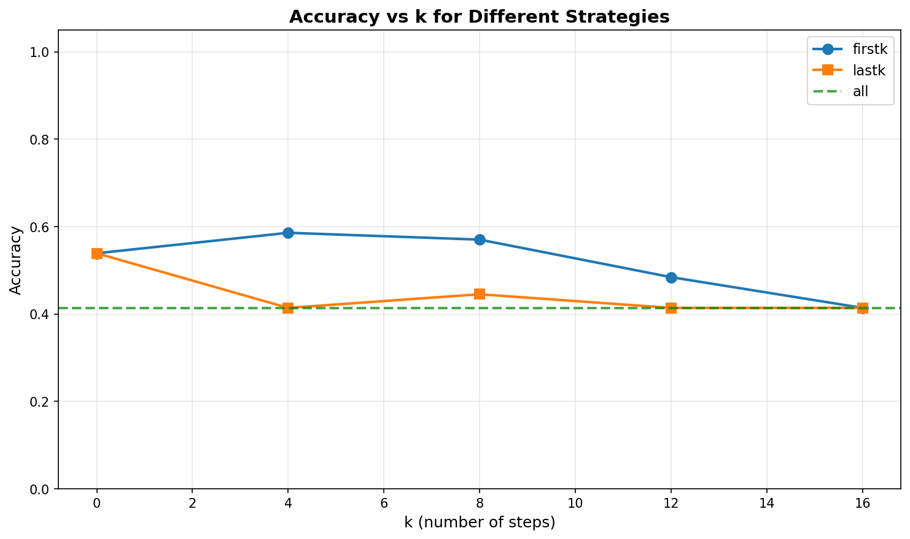
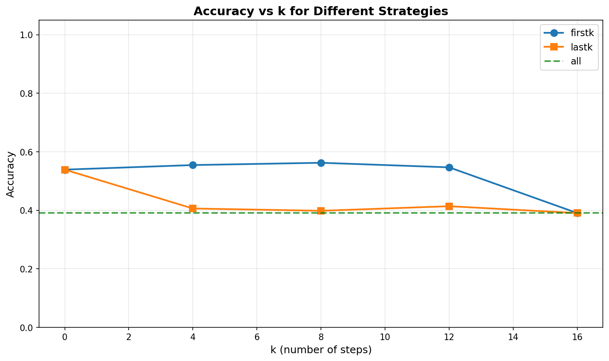

# DQuantize

A Python research project for studying **step-aware quantization in discrete diffusion language models (DLLMs)**.  
This repository accompanies our investigation into how quantization sensitivity varies across diffusion denoising steps and how this can be exploited for efficient inference.

---

## Abstract

Diffusion language models generate text through iterative denoising, enabling bidirectional context and parallel token prediction, but at the cost of high inference latency due to multiple denoising steps. While post-training quantization (PTQ) is well-studied for autoregressive LLMs, its applicability to diffusion LLMs remains underexplored.  
DQuantize introduces **step-aware quantization**, a simple yet effective strategy that selectively applies low-bit quantization to specific phases of the denoising process. By leveraging the observation that early denoising steps are more robust to quantization noise than later steps, DQuantize reduces memory bandwidth usage and inference cost while preserving model accuracy.

---

## Project Structure

```

DQuantize/
├── dquantize/           # Main source code
├── scripts/             # Utility and experiment scripts
├── third_party/         # Third-party code and dependencies
└── experiment_notes.md  # Research notes and experiment documentation

````

---

## Setup

### Prerequisites

Install `uv` (if not already installed):

```bash
curl -LsSf https://astral.sh/uv/install.sh | sh
````

Or using pip:

```bash
pip install uv
```

### Initial Setup

Initialize the project and create a virtual environment:

```bash
uv venv
source .venv/bin/activate  # On Windows: .venv\Scripts\activate
```

### Install Dependencies

Install project dependencies:

```bash
uv pip install -r requirements.txt
```

Or if using `pyproject.toml`:

```bash
uv sync
```

### Development

For development, install the package in editable mode:

```bash
uv pip install -e .
```

---

## Usage

To generate an AWQ-quantized LLaDA model:

```bash
cd third_party/QDLM/scripts
./llada_awq_generate_model.sh  # configure paths inside the script
```

All experiments can be run using the scripts in `scripts/`. Relevant documentation is included inside each script. For example, to run 4-bit experiments:

```bash
./scripts/run_dquantize_llada_all_strat_w4.sh      # first-k, last-k, and full quantization
./scripts/run_llada_quantization_analysis_w4.sh   # KL-divergence analysis
./scripts/run_llada_likelihood_analysis_w4.sh     # likelihood analysis
```

Results are saved to the `logs/` directory.

---

## Results

**Key empirical findings:**

* **Early denoising steps are significantly more robust to quantization** than later steps.
* **4-bit quantization** can be applied to a large fraction (>70%) of early steps with negligible accuracy loss.
* **3-bit quantization** is feasible but highly sensitive to which steps are quantized.
* **2-bit quantization** leads to catastrophic degradation even when applied to a small number of steps.
* Quantizing late denoising steps consistently causes sharp accuracy drops, highlighting their critical role.

### Accuracy vs Quantized Steps







---

## Takeaways

* Diffusion LLMs exhibit **non-uniform sensitivity to quantization across denoising steps**.
* Uniform, step-agnostic PTQ is suboptimal for diffusion models.
* Step-aware quantization enables **dynamic compression strategies** not possible in autoregressive decoding.
* Practical efficiency gains are achievable without retraining, using standard PTQ methods like AWQ.

---

## Future Work

* Extend step-aware quantization to other PTQ methods (e.g., GPTQ, SmoothQuant).
* Explore **fine-grained or adaptive policies** beyond simple first-k / last-k schedules.
* Develop optimized low-bit matrix multiplication kernels tailored to diffusion workloads.
* Investigate activation quantization and mixed weight–activation precision across steps.
* Apply step-aware strategies to other diffusion-based generative models beyond text.

---

## Resources

**Post-training quantization techniques**

* SmoothQuant: [https://www.youtube.com/watch?v=U0yvqjdMfr0](https://www.youtube.com/watch?v=U0yvqjdMfr0)
* AWQ: [https://www.youtube.com/watch?v=3dYLj9vjfA0](https://www.youtube.com/watch?v=3dYLj9vjfA0)
* GPTQ: [https://www.youtube.com/watch?v=OKpSgL9oMWU](https://www.youtube.com/watch?v=OKpSgL9oMWU)

**Discrete Diffusion Language Models**

* Large Language Diffusion Models: [https://arxiv.org/abs/2502.09992](https://arxiv.org/abs/2502.09992)
